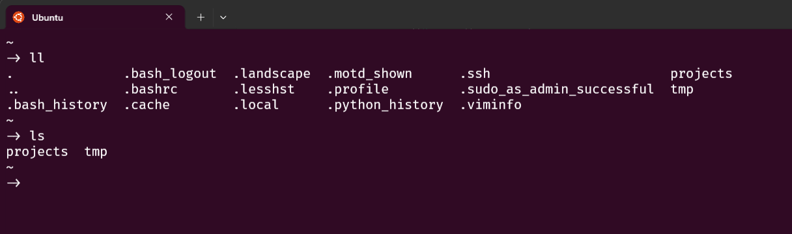

# bashrc-config

A minimal and personalized `.bashrc` configuration tailored for my daily workflow.





## Usage

To use this configuration, copy the `.bashrc` file to your home directory:

```bash
cp bashrc-config/.bashrc ~/.bashrc
source ~/.bashrc
```